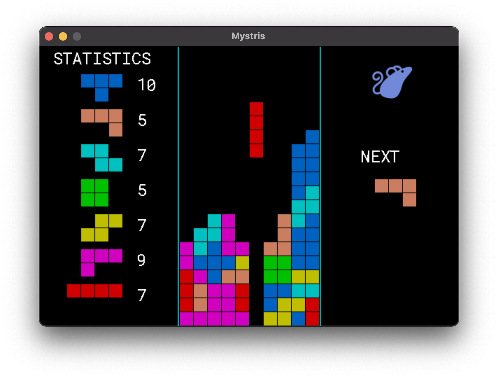

|discord|_
|test|_
|stars|_

About
=====

A tetris clone based on https://github.com/nsauzede/vsdl2 in the `Mys
programming language`_.

Project: https://github.com/mys-lang/package-mystris

Rotate with Z and X and move with left and right arrows.

Build and run.

.. code-block:: myscon

   ❯ mys run
   ...
    ✔ Getting linker flags for SDL2_ttf (0 seconds)
    ✔ Building (1.81 seconds)
   Mystris -- tribute to venerable Twintris

.. |discord| image:: https://img.shields.io/discord/777073391320170507?label=Discord&logo=discord&logoColor=white
.. _discord: https://discord.gg/GFDN7JvWKS

.. |test| image:: https://github.com/mys-lang/package-mystris/actions/workflows/pythonpackage.yml/badge.svg
.. _test: https://github.com/mys-lang/package-mystris/actions/workflows/pythonpackage.yml

.. |stars| image:: https://img.shields.io/github/stars/mys-lang/package-mystris?style=social
.. _stars: https://github.com/mys-lang/package-mystris

.. _Mys programming language: https://mys-lang.org
